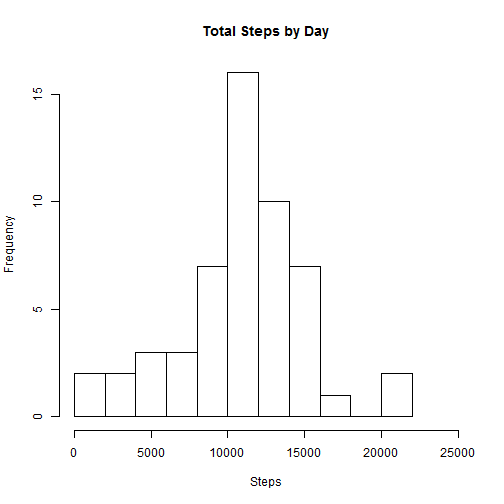
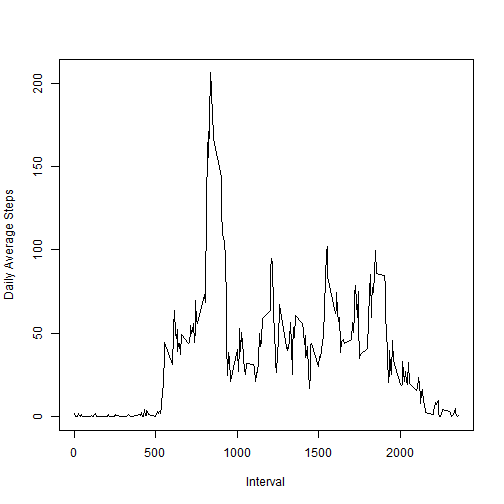
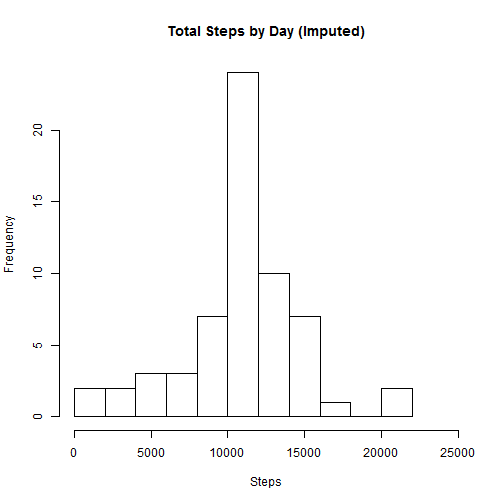
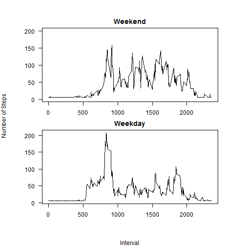

##Reproducible Research: Peer Assessment 1
========================================================

This document contains code and outcomes for the first Peer Assessment assignment for the course Reproducible Research. The data used is from an activity monitoring device.

## Loading and preprocessing the data

```r
fullData <- read.csv("activity.csv", stringsAsFactors=F)
install.packages("date")
```

```
## Installing package into 'C:/Users/hhessel/Documents/R/win-library/3.1'
## (as 'lib' is unspecified)
```

```
## Error: trying to use CRAN without setting a mirror
```

```r
library(date)
```

```
## Warning: package 'date' was built under R version 3.1.1
```

```r
fullData$date <- as.Date(fullData$date, format = "%Y-%m-%d")
options("scipen" = 100)
```

## What is mean total number of steps taken per day?

```r
stepsByDate <- by(fullData$steps, fullData$date, sum)
hist(stepsByDate, xlab="Steps", main="Total Steps by Day", xlim=c(0,25000), breaks=8)
```

 

```r
myMean <- mean(stepsByDate, na.rm=TRUE)
myMedian <- median(stepsByDate, na.rm=TRUE)
```
The mean total number of steps per day is 10766.1887.
The median number of steps per day is 10765.

## What is the average daily activity pattern?

```r
stepsByInterval <- aggregate(steps~interval, data=fullData, mean, na.rm=TRUE)
plot(stepsByInterval$steps~stepsByInterval$interval, type="l", xlab="Interval", ylab="Daily Average Steps")
```

 

```r
mostSteps <- stepsByInterval$interval[which.max(stepsByInterval$steps)]
```
The 5-minute interval with the maximum number of steps is 835.

## Imputing missing values

```r
totalNon <- sum(is.na(fullData$steps))
              
imputedDF <- fullData
mySteps <- mean(stepsByInterval$steps)
imputedDF$steps[is.na(imputedDF$steps)] <- mySteps

imputedStepsByDate <- by(imputedDF$steps, imputedDF$date, sum)
hist(imputedStepsByDate, xlab="Steps", main="Total Steps by Day (Imputed)", xlim=c(0,25000), breaks=8)
```

 

```r
imputedMean <- mean(imputedStepsByDate, na.rm=TRUE)
imputedMedian <- median(imputedStepsByDate, na.rm=TRUE)
```
The mean total number of steps per day is 10766.1887.
The median number of steps per day is now 10766.1887 too.
The values of the original and imputed data do not differ much. There is not much impact.

## Are there differences in activity patterns between weekdays and weekends?

```r
imputedDF$dayName <- weekdays(imputedDF$date)
imputedDF$dayType <- ifelse(imputedDF$dayName %in% c("Saturday","Sunday"),"weekend","weekday")


imputedStepsByIntervalWend <- aggregate(steps~interval, data=imputedDF[imputedDF$dayType == "weekend",], mean, na.rm=TRUE)
imputedStepsByIntervalWday <- aggregate(steps~interval, data=imputedDF[imputedDF$dayType == "weekday",], mean, na.rm=TRUE)

par(mfrow=c(2,1),mar=c(2,2,2,2), oma=c(4, 4, 2, 2), las=1)
plot(imputedStepsByIntervalWend$steps~imputedStepsByIntervalWend$interval, type="l", ylab="", main="Weekend", xlab="", ylim=c(0,200))
plot(imputedStepsByIntervalWday$steps~imputedStepsByIntervalWday$interval, type="l", main="Weekday", ylab="")
mtext("Number of Steps", 2, 3, outer=TRUE, las=0)
mtext("Interval", 1, 3, outer=TRUE)
```

 

Yes, there are definitely differences between weekends and weekdays.


